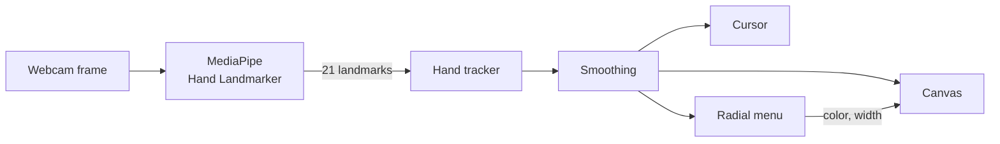

# ✍️ AirDraw

**Draw in the air with your hand.** AirDraw follows your hand through the webcam and turns a pinch into a pen. You can draw, change colors and change the line width without touching the mouse or keyboard.

Hand tracking runs entirely in your browser with [MediaPipe](https://ai.google.dev/edge/mediapipe/solutions/vision/hand_landmarker). No video ever leaves your computer.


## Features

- **Pinch to draw.** Touch your thumb and index finger together to put the pen down, and separate them to lift it.
- **Smooth, steady lines.** Raw hand tracking jitters. AirDraw filters it so the cursor stays still when your hand does, and it still keeps up when you move fast.
- **Reliable pinch detection.** Pinches are measured relative to your hand size, so detection works close to the camera, far away, and with a rotated hand.
- **Handles tracking hiccups.** Short tracking dropouts and single-frame glitches don't break your line or leave stray marks.
- **Hand skeleton overlay.** The webcam preview shows the detected hand. The thumb and index finger glow green while you pinch.
- **Gesture-only settings panel.** Hold ✌️ to open a radial menu with 8 colors and 6 line widths.
- **Live cursor.** A cross marks where the line will start. It also shows the current color, a brush-size outline for thick lines, and a progress ring while you hold ✌️.

## Gestures

| Gesture | Action |
| --- | --- |
| 🤏 Pinch (thumb + index finger) | Draw while pinched |
| ✌️ Hold for half a second | Open the color and line width panel |
| Move your hand a little, then 🤏 | Pick a color (inner ring) |
| Move your hand further up, then 🤏 | Pick a line width (outer arc) |
| 🤏 In the middle of the panel | Close the panel without changes |

> **Tip:** Once the panel is open, the pointer follows your **palm**, not your fingertips. A pinch moves your fingertips but barely moves your palm, so the pinch never knocks the pointer off the option you're picking.

## Getting started

### Requirements

- [Node.js](https://nodejs.org) **20.9** or newer
- A webcam
- A recent version of Chrome, Edge, Firefox or Safari (Chromium-based browsers are recommended for the best GPU performance)

### Run it locally

```bash
git clone https://github.com/toper1000/air-draw.git
cd air-draw
npm install
npm run dev
```

Open [http://localhost:3000](http://localhost:3000) and allow camera access.

For the best tracking:

- Use good, even lighting.
- Sit about an arm's length from the camera.
- Keep your whole hand in the picture.

> Browsers only allow camera access on secure pages. `localhost` counts as secure. To open the app from another device on your network, start the dev server with `npx next dev --experimental-https`.

### Scripts

| Command | Description |
| --- | --- |
| `npm run dev` | Start the development server |
| `npm run build` | Create a production build |
| `npm run start` | Serve the production build |
| `npm run lint` | Run ESLint |

## How it works



1. **Detection.** Each new webcam frame is passed to MediaPipe's Hand Landmarker, which returns 21 points on the hand. The Hand Landmarker runs in VIDEO mode on the GPU. Frames are read with `requestVideoFrameCallback`, so detection runs exactly once per camera frame and never on the same frame twice.
2. **Tracking.** The pen tip is the midpoint between the thumb tip and the index fingertip.
   - **Pinch ratio.** The 3D gap between those two fingertips is divided by the size of the hand, so the result doesn't depend on distance from the camera.
   - **Pinch hysteresis.** A pinch starts below a ratio of `0.6` and ends above `0.8`, and each change must hold for 2 frames. This stops flickering near the threshold.
   - **Glitch filter.** A jump that would require an impossible hand speed is ignored for one frame.
   - **Brief dropouts.** A hand lost for up to 250 ms is treated as the same hand.
3. **Smoothing.** On every display frame, the position goes through two filters:
   - A [1€ filter](https://gery.casiez.net/1euro/), which smooths heavily when the hand is slow and lightly when it's fast.
   - A short "leash" (lazy brush), which ignores the tiny tremors that are left.
4. **Drawing.** Strokes are drawn piece by piece as quadratic curves through the midpoints between samples, so the whole path never needs to be redrawn. If a pinch is lost for a split second, the same stroke continues instead of starting a new one.
5. **Menu.** The ✌️ pose is recognized from finger geometry:
   - index and middle fingers straight;
   - ring and pinky fingers curled;
   - thumb tucked in;
   - no pinch.

   The pose has to be held for 500 ms. After the panel opens, the pointer's distance from the center picks the ring, and its angle picks the option. Small "sticky" margins keep the selection from flickering between neighboring options.

Hand data changes about 60 times per second, so it lives in shared React refs, not in React state. Each component reads the refs in its own `requestAnimationFrame` loop, and React only re-renders when something visible changes, such as the highlighted menu option.

## Project structure

```
src/
├── app/
│   ├── layout.tsx            Root layout
│   └── page.tsx              Renders the workspace
├── components/
│   ├── Workspace.tsx         Holds the shared hand and menu state
│   ├── Webcam.tsx            Camera, MediaPipe model, detection loop
│   ├── CanvasBoard.tsx       Drawing canvas
│   ├── HandCursor.tsx        Cursor with color dot, brush outline and ✌️ progress ring
│   └── WheelMenu.tsx         Color and line width panel (UI)
├── lib/
│   ├── handTracker.ts        Turns raw landmarks into a stable hand state
│   ├── handGeometry.ts       Pen point, palm point, pinch ratio, finger extension
│   ├── pinchDetector.ts      Pinch hysteresis
│   ├── menuGesture.ts        ✌️ detection and hold timer
│   ├── cursorSmoother.ts     1€ filter + leash
│   ├── oneEuroFilter.ts      1€ filter
│   ├── leash.ts              Lazy-brush leash
│   ├── wheelMenu.ts          Panel logic: opening, hovering, picking
│   └── drawHandSkeleton.ts   Hand skeleton overlay
└── types.ts                  Shared types
```

## Tuning

Most of the behavior can be adjusted with constants at the top of each file:

| What | Constants | File |
| --- | --- | --- |
| Pinch sensitivity | `PINCH_ON`, `PINCH_OFF` | `src/lib/pinchDetector.ts` |
| Cursor smoothing | `minCutoff`, `beta`, leash length | `src/lib/cursorSmoother.ts` |
| Dropout grace time, glitch filter | `HAND_LOST_MS`, `MAX_SPEED`, `NEW_TRACK_SPEED` | `src/lib/handTracker.ts` |
| ✌️ hold time | `MENU_HOLD_MS` | `src/lib/menuGesture.ts` |
| Colors, line widths, panel size | `MENU_COLORS`, `LINE_WIDTHS`, `MENU_RADIUS` | `src/lib/wheelMenu.ts` |
| Stroke continuation after a lost pinch | `RESUME_MS`, `RESUME_PX` | `src/components/CanvasBoard.tsx` |

## Privacy

All processing happens locally in your browser, and camera frames are never uploaded. The only network requests download the MediaPipe runtime (from jsDelivr) and the hand model (from Google Cloud Storage) when the page loads.

## Limitations

- Only one hand is tracked at a time.
- There is no undo, clear or export yet. Reloading the page clears the drawing.
- The canvas is sized when the page loads. Resizing the window afterwards doesn't resize it.
- Tracking quality depends on lighting and the camera.

## Acknowledgements

- [MediaPipe Hand Landmarker](https://ai.google.dev/edge/mediapipe/solutions/vision/hand_landmarker) by Google
- [1€ Filter](https://gery.casiez.net/1euro/) by Géry Casiez, Nicolas Roussel and Daniel Vogel (CHI 2012)

## License

AirDraw is released under the [MIT License](LICENSE).
